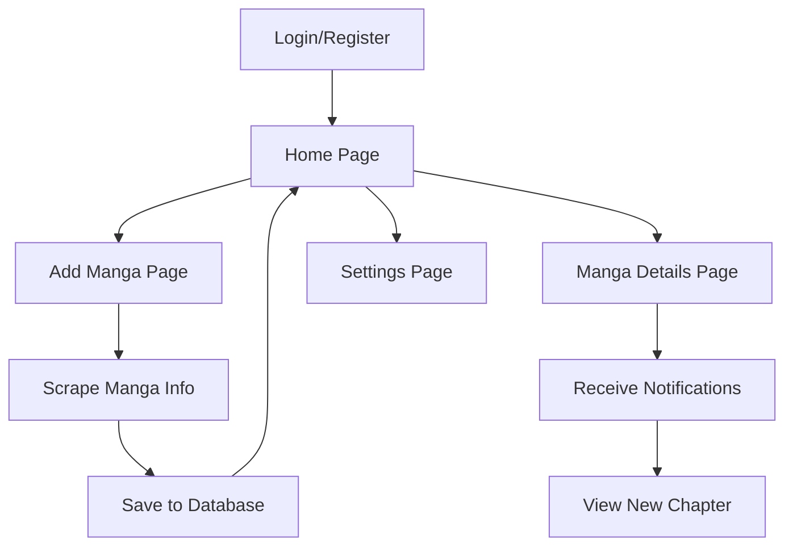

## 1. Product Overview
Aplicación PWA para guardar y hacer seguimiento de mangas favoritos de cualquier página web, con notificaciones automáticas cuando salen nuevos capítulos.

Permite a los usuarios agregar mangas desde URLs, visualizar los últimos 4 capítulos lanzados y recibir notificaciones push en móvil cuando se publican capítulos nuevos.

## 2. Core Features

### 2.1 User Roles
| Role | Registration Method | Core Permissions |
|------|---------------------|------------------|
| User | Email registration | Add mangas, receive notifications, view chapters |

### 2.2 Feature Module
La aplicación consta de las siguientes páginas principales:
1. **Home page**: lista de mangas guardados, últimos capítulos, navegación principal.
2. **Add manga page**: formulario para agregar manga desde URL, preview de información.
3. **Manga details page**: información del manga, lista de capítulos, configuración de notificaciones.
4. **Settings page**: preferencias de notificaciones, cuenta de usuario.

### 2.3 Page Details
| Page Name | Module Name | Feature description |
|-----------|-------------|---------------------|
| Home page | Manga list | Mostrar mangas guardados con portada, título y último capítulo leído. |
| Home page | Recent chapters | Mostrar los últimos 4 capítulos de todos los mangas seguidos. |
| Home page | Navigation | Barra de navegación con acceso a agregar manga y configuración. |
| Add manga page | URL input | Campo para ingresar URL del manga desde cualquier página. |
| Add manga page | Auto-scraping | Usar Firecrawl + Gemini para extraer información del manga. |
| Add manga page | Preview | Mostrar preview de título, portada y sinopsis antes de guardar. |
| Manga details page | Chapter list | Lista de capítulos con fecha de publicación y estado. |
| Manga details page | Notification toggle | Activar/desactivar notificaciones para ese manga. |
| Settings page | Notification preferences | Configurar frecuencia y tipo de notificaciones. |
| Settings page | Account management | Ver información de cuenta y cerrar sesión. |

## 3. Core Process

**Flujo principal del usuario:**
1. Usuario se registra con email
2. Agrega mangas ingresando URLs desde cualquier página de mangas
3. Sistema scrapea la información usando Firecrawl y Gemini
4. Usuario ve lista de mangas y últimos capítulos en home
5. Sistema monitorea nuevos capítulos periódicamente
6. Usuario recibe notificación push cuando sale capítulo nuevo
7. Usuario puede ver detalles y marcar capítulos como leídos

## 4. User Interface Design

### 4.1 Design Style
- **Colores primarios**: Azul oscuro (#1a1a2e), blanco (#ffffff)
- **Colores secundarios**: Gris claro (#f5f5f5), azul acento (#16213e)
- **Botones**: Estilo moderno con bordes redondeados, sombras sutiles
- **Tipografía**: Inter o Roboto, tamaños base 16px para móvil, 18px para desktop
- **Layout**: Card-based con grid responsivo, máximo 3 columnas en desktop
- **Iconos**: Material Design Icons o Heroicons

### 4.2 Page Design Overview
| Page Name | Module Name | UI Elements |
|-----------|-------------|-------------|
| Home page | Manga list | Grid de cards con imagen de portada, título, último capítulo y badge de notificaciones. |
| Home page | Recent chapters | Lista horizontal deslizable con miniaturas de capítulos recientes. |
| Add manga page | URL input | Input grande con botón de búsqueda, indicador de carga durante scraping. |
| Add manga page | Preview | Card con imagen, título, sinopsis y botones de confirmar/cancelar. |
| Manga details page | Chapter list | Lista scrollable con fecha, número de capítulo y estado de lectura. |
| Settings page | Preferences | Toggle switches para notificaciones, selector de frecuencia. |

### 4.3 Responsiveness
- Diseño mobile-first con breakpoints en 768px y 1024px
- Touch optimizado para navegación por swipe
- PWA instalable con manifest.json
- Funcionamiento offline básico para ver mangas guardados