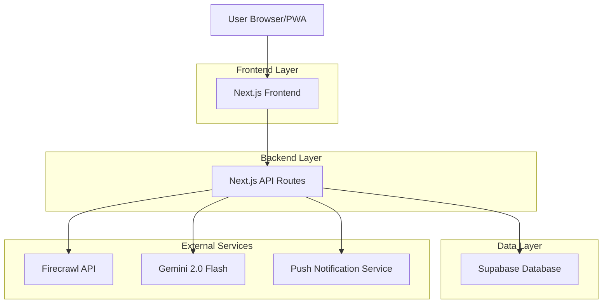
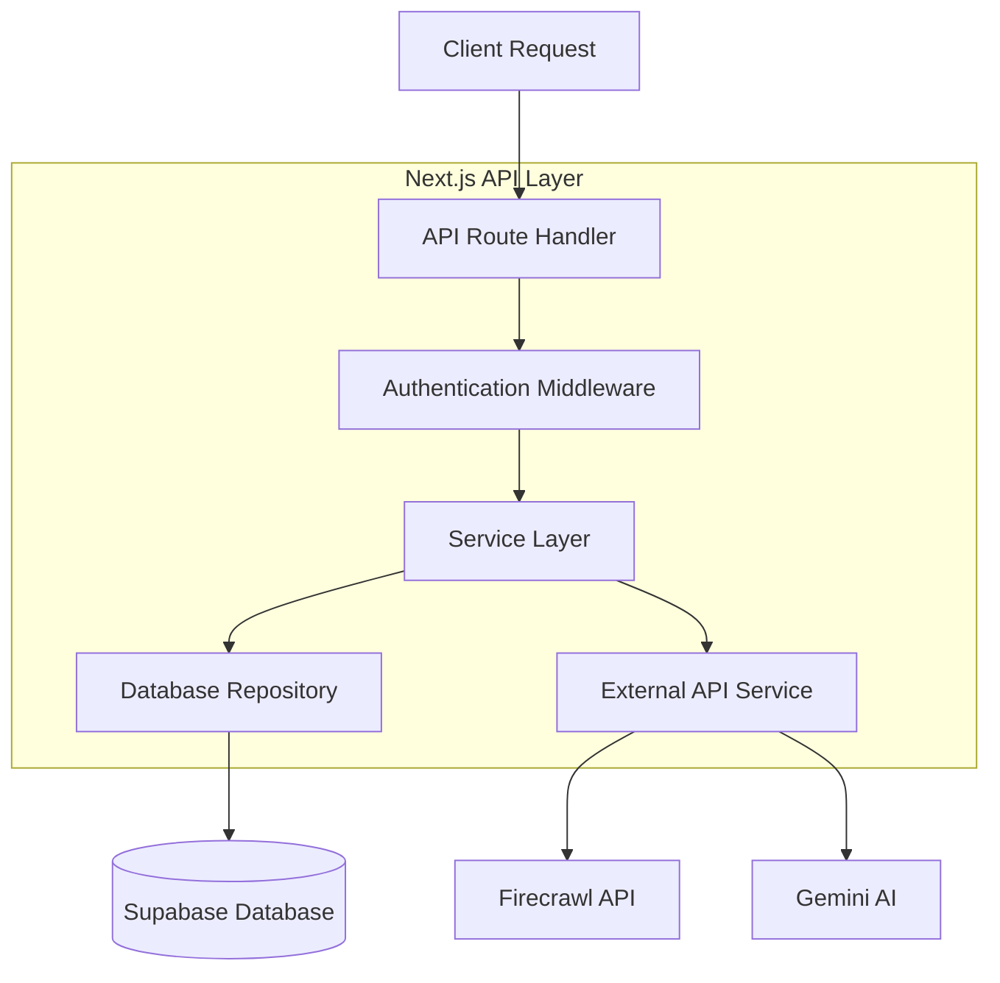
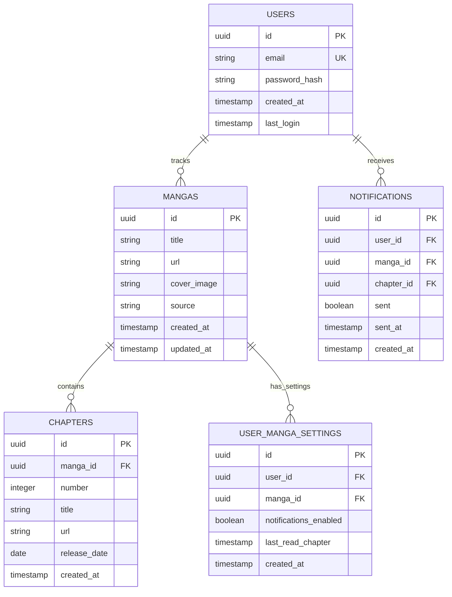

## 1. Architecture design



## 2. Technology Description

- **Frontend**: Next.js 14 + React 18 + Tailwind CSS 3
- **Initialization Tool**: create-next-app
- **Backend**: Next.js API Routes
- **Database**: Supabase (PostgreSQL)
- **AI/Scraping**: Firecrawl API + Google Generative AI (Gemini 2.0 Flash)
- **PWA**: next-pwa plugin
- **Notifications**: Web Push API + VAPID keys

## 3. Route definitions

| Route | Purpose |
|-------|---------|
| / | Home page, lista de mangas y últimos capítulos |
| /add-manga | Formulario para agregar nuevo manga |
| /manga/[id] | Detalles del manga y lista de capítulos |
| /settings | Configuración de usuario y notificaciones |
| /api/auth/* | Endpoints de autenticación con Supabase |
| /api/manga/* | CRUD de mangas y capítulos |
| /api/scrape | Scraping de información de manga |
| /api/notifications | Gestión de notificaciones push |

## 4. API definitions

### 4.1 Manga Management APIs

**Agregar nuevo manga**
```
POST /api/manga/add
```

Request:
| Param Name | Param Type | isRequired | Description |
|------------|------------|------------|-------------|
| url | string | true | URL del manga |
| title | string | false | Título (opcional, se extrae si no se proporciona) |

Response:
| Param Name | Param Type | Description |
|------------|------------|-------------|
| id | string | ID del manga en base de datos |
| title | string | Título del manga |
| cover_url | string | URL de la imagen de portada |
| chapters | array | Lista de capítulos encontrados |

**Obtener mangas del usuario**
```
GET /api/manga/list
```

Response:
```json
{
  "mangas": [
    {
      "id": "uuid",
      "title": "One Piece",
      "cover_url": "https://example.com/cover.jpg",
      "last_chapter": 1095,
      "unread_count": 2,
      "updated_at": "2024-01-15T10:30:00Z"
    }
  ]
}
```

**Scraping automático**
```
POST /api/scrape/analyze
```

Request:
| Param Name | Param Type | isRequired | Description |
|------------|------------|------------|-------------|
| url | string | true | URL a analizar |

Response:
```json
{
  "title": "One Piece",
  "cover_image": "https://example.com/cover.jpg",
  "chapters": [
    {
      "number": 1095,
      "title": "Chapter Title",
      "url": "https://example.com/chapter/1095",
      "release_date": "2024-01-15"
    }
  ],
  "source": "mangaplus"
}
```

## 5. Server architecture diagram



## 6. Data model

### 6.1 Data model definition



### 6.2 Data Definition Language

**Tabla de usuarios**
```sql
-- Crear tabla de usuarios
CREATE TABLE users (
    id UUID PRIMARY KEY DEFAULT gen_random_uuid(),
    email VARCHAR(255) UNIQUE NOT NULL,
    password_hash VARCHAR(255) NOT NULL,
    created_at TIMESTAMP WITH TIME ZONE DEFAULT NOW(),
    last_login TIMESTAMP WITH TIME ZONE,
    notification_token TEXT
);

-- Crear tabla de mangas
CREATE TABLE mangas (
    id UUID PRIMARY KEY DEFAULT gen_random_uuid(),
    title VARCHAR(255) NOT NULL,
    url TEXT UNIQUE NOT NULL,
    cover_image TEXT,
    source VARCHAR(50),
    created_at TIMESTAMP WITH TIME ZONE DEFAULT NOW(),
    updated_at TIMESTAMP WITH TIME ZONE DEFAULT NOW()
);

-- Crear tabla de capítulos
CREATE TABLE chapters (
    id UUID PRIMARY KEY DEFAULT gen_random_uuid(),
    manga_id UUID REFERENCES mangas(id) ON DELETE CASCADE,
    number INTEGER NOT NULL,
    title VARCHAR(255),
    url TEXT NOT NULL,
    release_date DATE,
    created_at TIMESTAMP WITH TIME ZONE DEFAULT NOW(),
    UNIQUE(manga_id, number)
);

-- Crear tabla de configuración usuario-manga
CREATE TABLE user_manga_settings (
    id UUID PRIMARY KEY DEFAULT gen_random_uuid(),
    user_id UUID REFERENCES users(id) ON DELETE CASCADE,
    manga_id UUID REFERENCES mangas(id) ON DELETE CASCADE,
    notifications_enabled BOOLEAN DEFAULT true,
    last_read_chapter INTEGER DEFAULT 0,
    created_at TIMESTAMP WITH TIME ZONE DEFAULT NOW(),
    UNIQUE(user_id, manga_id)
);

-- Crear tabla de notificaciones
CREATE TABLE notifications (
    id UUID PRIMARY KEY DEFAULT gen_random_uuid(),
    user_id UUID REFERENCES users(id) ON DELETE CASCADE,
    manga_id UUID REFERENCES mangas(id) ON DELETE CASCADE,
    chapter_id UUID REFERENCES chapters(id) ON DELETE CASCADE,
    sent BOOLEAN DEFAULT false,
    sent_at TIMESTAMP WITH TIME ZONE,
    created_at TIMESTAMP WITH TIME ZONE DEFAULT NOW()
);

-- Crear índices para mejorar rendimiento
CREATE INDEX idx_chapters_manga_id ON chapters(manga_id);
CREATE INDEX idx_chapters_release_date ON chapters(release_date DESC);
CREATE INDEX idx_user_manga_user_id ON user_manga_settings(user_id);
CREATE INDEX idx_notifications_user_id ON notifications(user_id);
CREATE INDEX idx_notifications_sent ON notifications(sent);

-- Permisos de Supabase
GRANT SELECT ON ALL TABLES TO anon;
GRANT ALL PRIVILEGES ON ALL TABLES TO authenticated;
```